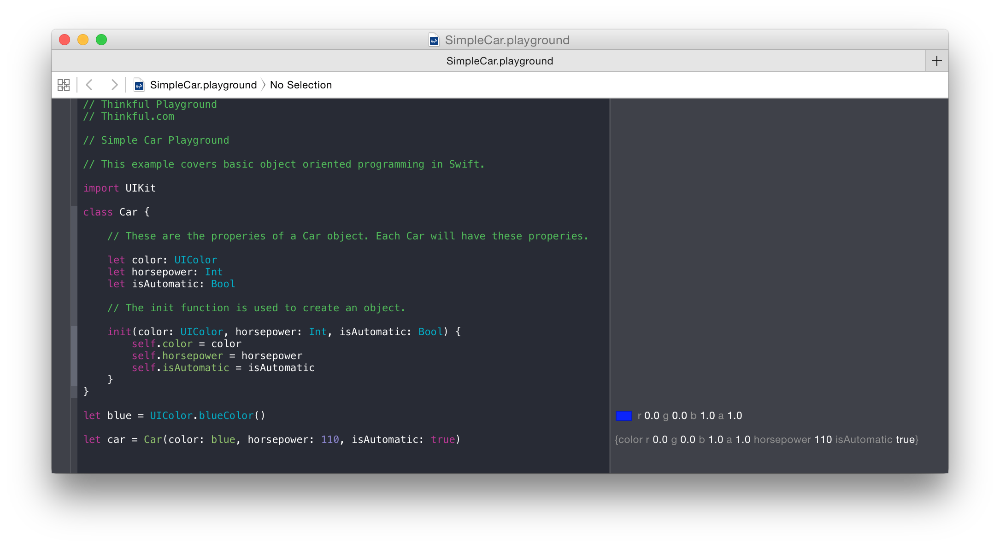

# Car Playground

This example covers basic object oriented programming in Swift.

The SimpleCar.playground is very basic:

The Car.playground contains a Car class and a few subclasses called HybridCar, Lowrider, and Slab.

# Notes

This project is part of Thinkful's course [Intro to iOS Programming in Swift](http://thinkful.com)